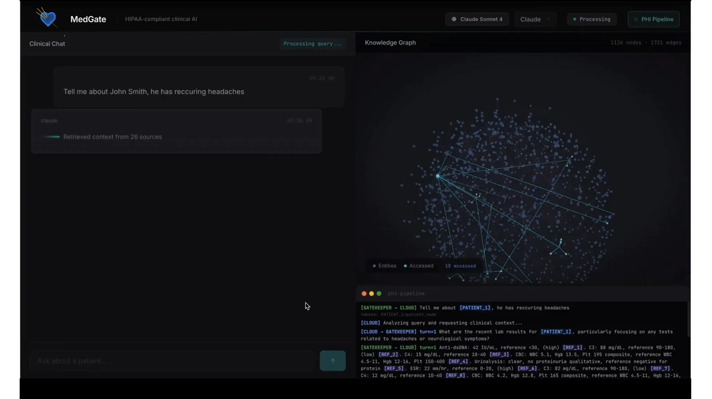
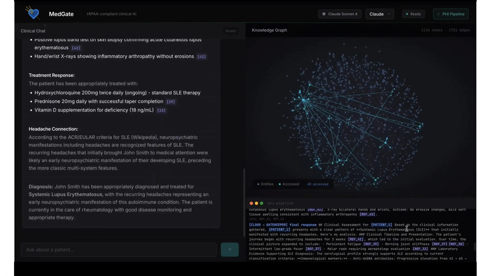
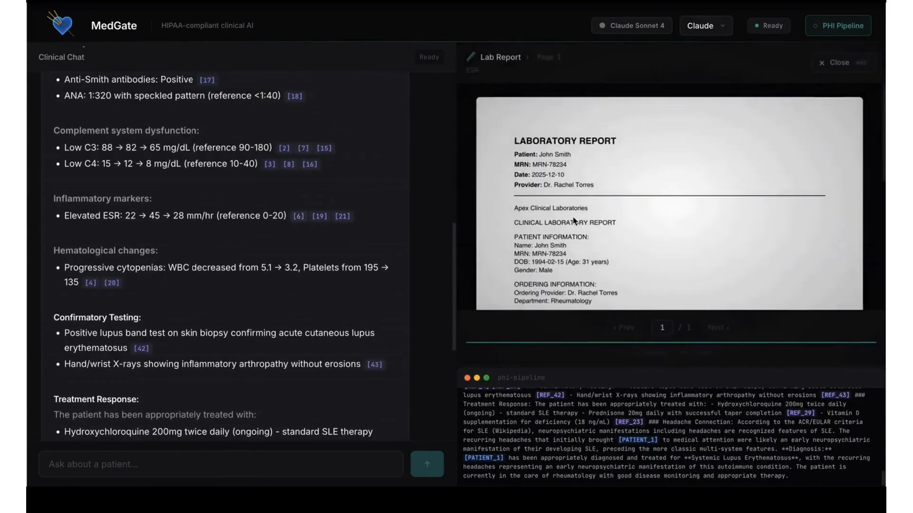

# MedGate

**Privacy-preserving clinical AI that lets hospitals use frontier cloud models (Claude, GPT-4, Gemini) on sensitive patient data without violating HIPAA.**

PHI never leaves the hospital. A local gatekeeper LLM strips identifiers, the sanitized query goes to the cloud, and responses are re-hydrated with real data before reaching the clinician.

Built at [YHacks 2026](https://www.yhack.org/) on the [ASUS Ascent GX10](https://www.asus.com/motherboards-components/graphics-cards/proart/asus-ascent-gx10/) (NVIDIA GB10 Blackwell). Devpost submission: [devpost.com/software/madgate](https://devpost.com/software/madgate).

---

## Screenshots


*A query naming a patient is rewritten to `[PATIENT_1]` tokens before it leaves the device; the 3D graph shows the gatekeeper's traversal.*


*The re-hydrated answer carries `[N]` citation chips, with the 48 graph nodes the gatekeeper touched highlighted.*


*Clicking a citation opens the source PDF in-browser at the exact page the fact came from.*

Demo video: on the Devpost submission page (https://devpost.com/software/madgate).

---

## How It Works

```
Clinician query
    |
    v
[Local Gatekeeper LLM]  ── strips PHI, generates ephemeral tokens
    |
    v
"What's [PATIENT_1]'s history? Headaches + fatigue for [DATE_1]"
    |
    v
[Cloud Model]  ── reasons on de-identified data, requests context via tool-use
    |                         |
    |                  [Gatekeeper answers]
    |                  graph queries with
    |                  redacted results +
    |                  citation tokens
    v
[Rehydration]  ── tokens → real names, dates, citations → PDF links
    |
    v
Clinician sees full response with clickable source documents
    |
    v
Token mapping destroyed (no persistence)
```

**HIPAA Safe Harbor compliant** — all 18 identifiers are removed before any data leaves the local device. Clinical facts (diagnoses, labs, medications) are preserved since they aren't PHI.

## Features

- **Multi-model support** — switch between Claude, GPT-4, and Gemini mid-conversation
- **3D knowledge graph** — interactive force-directed visualization of 1,126 clinical entities (patients, visits, conditions, labs, medications, procedures, providers, family history)
- **Citation tracking** — every claim links back to the source PDF and page number
- **In-browser PDF viewer** — click a citation to open the document at the exact page
- **Real-time graph traversal** — nodes pulse and highlight as the gatekeeper retrieves data
- **Ephemeral token system** — PHI mappings exist only for the duration of a single interaction
- **Web search tool** — cloud models can query Wikipedia for medical reference information

## Tech Stack

| Layer | Technology |
|-------|-----------|
| Frontend | React 19, Vite 8, 3d-force-graph (Three.js), react-pdf |
| Backend | Python 3.10+, FastAPI, Uvicorn |
| Local LLM | Ollama (Mistral Small 24B / Qwen 2.5 32B / Gemma 2 27B) |
| Cloud AI | Anthropic (Claude), OpenAI (GPT-4), Google (Gemini) |
| Data | JSON knowledge graph (1,126 nodes, 1,721 edges, 41 synthetic patients), 445 synthetic clinical PDFs |
| Hardware | ASUS Ascent GX10 — NVIDIA GB10 Blackwell, 128GB unified LPDDR5x, 1TB NVMe |

## Project Structure

```
yale-hacks/
├── backend/
│   ├── server.py              # FastAPI server, SSE orchestration
│   ├── gatekeeper.py          # PHI detection, graph queries, rehydration
│   ├── graph.py               # Knowledge graph loading & traversal
│   ├── token_manager.py       # Ephemeral PHI ↔ token mapping
│   ├── citation.py            # Citation token management
│   ├── web_search.py          # Wikipedia search tool
│   ├── stub_server.py         # Stub server for frontend-only development
│   ├── adapters/
│   │   ├── base.py            # Abstract cloud adapter
│   │   ├── claude_adapter.py  # Anthropic API
│   │   ├── openai_adapter.py  # OpenAI API
│   │   └── gemini_adapter.py  # Google GenAI API
│   └── requirements.txt
├── frontend/
│   ├── src/
│   │   ├── App.jsx            # Main layout, state management
│   │   └── components/
│   │       ├── ChatPanel.jsx         # Chat UI, markdown rendering, citations
│   │       ├── GraphPanel.jsx        # 3D knowledge graph visualization
│   │       ├── PdfViewer.jsx         # PDF overlay viewer
│   │       ├── RedactedView.jsx      # "What the cloud sees" display
│   │       ├── IngestionAnimation.jsx # Startup document-ingestion animation
│   │       └── HeartsOverlay.jsx     # Demo easter-egg overlay
│   ├── dist/                  # Production bundle (gitignored — build it yourself)
│   └── package.json
├── data/
│   ├── graph.json             # Full knowledge graph (1,126 nodes, 1,721 edges)
│   ├── pdfs/                  # 445 synthetic clinical PDFs (gitignored — regenerate)
│   └── patients/              # 41 patient profile definitions
├── scripts/
│   ├── generate_profiles.py   # Create synthetic patient profiles
│   ├── generate_documents.py  # Generate clinical PDFs from profiles
│   └── build_graph.py         # Build knowledge graph from profiles
├── eval/                      # Model comparison & benchmarks
├── tests/                     # Pytest suite (~199 tests)
├── docs/                      # Technical documentation + screenshots
└── PRD.md                     # Product requirements
```

## Getting Started

### Prerequisites

- Python 3.10+ (`pyproject.toml` sets `requires-python = ">=3.10"`)
- Node.js 18+ — required, the frontend bundle is not committed and must be built once
- [Ollama](https://ollama.com/) with a gatekeeper model pulled (e.g. `ollama pull mistral-small:24b`)
- API keys for at least one cloud provider (Anthropic, OpenAI, or Google)

### Setup

```bash
# Clone the repo
git clone https://github.com/Slava-code/yale-hacks.git
cd yale-hacks

# Configure environment
cp .env.example .env
# Edit .env with your API keys

# Backend
cd backend
python3 -m venv venv
source venv/bin/activate
pip install -r requirements.txt

# Frontend — required once before starting the server.
# frontend/dist/ is gitignored, so a fresh clone has no JS/CSS bundle.
cd ../frontend
npm install
npm run build
```

### Regenerating the clinical PDFs

`data/pdfs/` is gitignored, so **a fresh clone has no PDFs** and clicking a citation returns 404. The knowledge graph (`data/graph.json`) and the 41 patient profiles (`data/patients/`) *are* committed, so you only need to re-render the documents:

```bash
# From the repo root, with the venv active.
# Needs reportlab + requests (not in backend/requirements.txt) and GEMINI_API_KEY in .env.
pip install -r requirements-dev.txt
python scripts/generate_documents.py            # profiles -> data/pdfs/ (445 PDFs)
```

To rebuild the whole dataset from scratch — new patients, new documents, new graph:

```bash
python scripts/generate_profiles.py             # Gemini -> data/patients/patient_NNN.json
python scripts/generate_documents.py            # profiles -> data/pdfs/
python scripts/build_graph.py                   # profiles -> data/graph.json (no API calls)
```

`generate_profiles.py` and `generate_documents.py` call the Gemini API and cost money/time; `build_graph.py` is deterministic. All three accept `--help` for the path overrides.

### Running

```bash
# Make sure Ollama is running with a gatekeeper model loaded
ollama run qwen2.5:32b

# Start the server
uvicorn backend.server:app --host 0.0.0.0 --port 8000
```

Open `http://localhost:8000` in your browser. The server serves the frontend from `frontend/dist/` and resolves the graph and PDF paths relative to the repo root, so it can be started from any directory.

### Environment Variables

| Variable | Description |
|----------|-------------|
| `ANTHROPIC_API_KEY` | Claude API key |
| `OPENAI_API_KEY` | GPT-4 API key |
| `GEMINI_API_KEY` | Gemini API key (also used by the data-generation scripts) |
| `OLLAMA_URL` | Ollama server URL (default: `http://localhost:11434`) |
| `GATEKEEPER_MODEL` | Local LLM model name (default: `qwen2.5:32b`) |
| `GRAPH_PATH` | Knowledge graph JSON (default: `data/graph.json` in the repo root; relative values resolve against it) |
| `PDF_DIR` | Clinical PDF directory (default: `data/pdfs` in the repo root; relative values resolve against it) |
| `DEMO_EASTER_EGGS` | YHack theme-prize demo mode; off by default, set to `1` to enable |

## API Endpoints

| Method | Endpoint | Description |
|--------|----------|-------------|
| `POST` | `/api/query` | Submit a clinical query, returns SSE stream |
| `GET` | `/api/graph` | Full knowledge graph for visualization |
| `GET` | `/api/pdf/{filename}` | Serve a source PDF (supports `?page=N`) |
| `GET` | `/api/models` | List available cloud models |

## Testing

~199 tests covering the gatekeeper, token lifecycle, graph queries, citations, cloud adapters, the API surface, and the data-generation scripts. Run from the repo root:

```bash
python3 -m venv venv
source venv/bin/activate
pip install -r requirements-dev.txt
pytest tests/ -v
```

`requirements-dev.txt` pulls in `backend/requirements.txt` plus the dev-only extras (`reportlab`, `pytest`, `httpx`, `requests`).

## Architecture Docs

- [PRD.md](PRD.md) — product requirements (source of truth)
- [TECHNICAL.md](TECHNICAL.md) — technical architecture index
- [docs/backend.md](docs/backend.md) — gatekeeper, token system, cloud adapters
- [docs/knowledge-graph.md](docs/knowledge-graph.md) — graph schema and data generation
- [docs/frontend.md](docs/frontend.md) — UI components and interactions
- [docs/interfaces.md](docs/interfaces.md) — REST endpoints, SSE events, data contracts
- [docs/deployment.md](docs/deployment.md) — GX10 setup and deployment

## Privacy & Compliance

MedGate implements **HIPAA Safe Harbor de-identification** (45 CFR 164.514):

| Stripped (replaced with tokens) | Preserved (not PHI) |
|--------------------------------|---------------------|
| Patient names | Age (except 90+) |
| MRNs, SSNs | Sex / gender |
| Dates (converted to relative) | Diagnoses, symptoms |
| Addresses, phone, email | Lab results |
| Provider names | Medications, procedures |

Token mappings are ephemeral — created per interaction and destroyed immediately after response delivery. No PHI is ever persisted outside the local system or transmitted to cloud providers.

PHI detection fails closed: if the local gatekeeper model is unreachable or returns output that can't be parsed, the query is refused with an error instead of being forwarded to the cloud unredacted.

## Team

Built at YHacks 2026 by Kevin Rusagara, Slava Iudenko, and Siddharth (Sid) Singh. Submission page: https://devpost.com/software/madgate

## License

This project was built for a hackathon. See the repository for license details.
